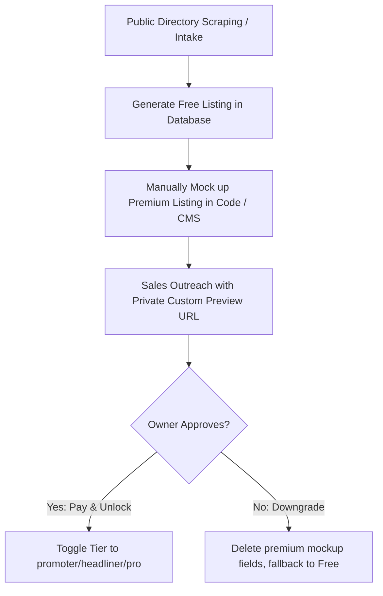

# PRD: OutATL Pricing Restructuring & B2B Funnel Optimization

## 1. Executive Summary & Objective

**OutATL** is transitioning from a temporary 2026 World Cup directory to an evergreen, high-yield digital hub for Atlanta's LGBTQ+ economy. 

To maximize customer lifetime value (LTV), lower customer acquisition friction (CAC), and mitigate post-World Cup churn, this document outlines the product requirements to:
1. Implement a two-phase pricing model: **Founder Rates** (active until July 19, 2026) and **Post-World Cup Standard Rates** (effective July 20, 2026).
2. Segment premium pricing to capture high-margin **Professional Services** (Real Estate, Medical, Legal) at a higher price point than standard neighborhood venues.
3. Optimize the annual payment discounts to secure front-loaded cash flow and mitigate monthly churn.
4. Establish the B2B sales funnel logic around a high-conversion **"Listed but Locked" preview pipeline**.

---

## 2. Target Pricing & Feature Architecture

### Phase 1: Founder Rates (Active until July 19, 2026)
*Target: Incentivize early adopters to lock in grandfathered rates during the final weeks of the World Cup.*

> Annual Rate column corrected below to match what shipped (`docs/contracts/`, `value_ladder_evolution.md` Iteration 3) — the original draft quoted $290/$990/$1,290/yr.

| Tier | Monthly Rate | Annual Rate | Key Features Locked/Unlocked |
| :--- | :--- | :--- | :--- |
| **On the Map (Free)** | $0 | $0 | Standard text listing, 1 exterior photo. No links, maps, or events. |
| **Promoter (Venues/Cafes)** | $29 / mo | $199 / yr | Clickable website/social links, 5 photos, up to 3 weekly events, map. |
| **Headliner (Nightlife/Clubs)** | $99 / mo | $699 / yr | Pinned search, spotlight rotation, video header, unlimited events, custom CTA. |
| **Professional Services** | $129 / mo | $899 / yr | Pinned search, B2B lead capture, premium bio, logo placement, local map packs. |

### Phase 2: Post-World Cup Standard Rates (Starts July 20, 2026)
*Target: Evergreen, standardized commercial directory rates for all new entrants.*

| Tier | Monthly Rate | Annual Rate | Optimization Strategy |
| :--- | :--- | :--- | :--- |
| **On the Map (Free)** | $0 | $0 | Pure database builder and lead magnet. |
| **Promoter (Venues/Cafes)** | $49 / mo | $399 / yr | Annual option priced aggressively ($399 vs. $588 monthly sum) to lock cash up front. |
| **Headliner (Nightlife/Clubs)** | $199 / mo | $1,490 / yr | Standard monthly increased from $149 to $199 to reflect immediate cover-charge ROI. |
| **Professional Services** | $299 / mo | $2,290 / yr | Priced to reflect massive AOV/LTV in high-value B2B sectors (Real Estate, Legal, Medical). |

---

## 3. B2B Sales Funnel: The "Listed but Locked" Pipeline

To leverage the sales strategy of building the premium listing before approaching the merchant, we require the following system flow:



### Technical Requirements:
1. **Dynamic Content Filtering:**
   * Modify the frontend listing detail pages (`src/pages/businesses/[slug].astro` and `/es/businesses/[slug].astro`) and sidebars (`SmartSidebar.astro`) to look up the business `tier`.
   * If `tier === "free"`, strip clickable `website` and `socials` properties, and replace them with a card: *"Unlock official links, social media handles, and weekly event calendars by joining our Promoter program."*
2. **Sales Preview Route:**
   * Support a preview parameter or custom state (e.g. `/businesses/[slug]?preview=true`) that renders the full, premium mock-up to the owner even if the database state is currently set to `free`. This allows Jacob to send a live, high-fidelity mock-up link to a prospect to trigger loss-aversion psychology.
3. **Stripe & Typeform Integration:**
   * Build/update the `/list-your-business` pricing cards to dynamically toggle pricing between Monthly and Annual.
   * Connect checkout buttons to Stripe payment links configured with correct pricing metadata (`tier`, `billing_cycle`, `business_slug`).

---

## 4. Codebase Tasks & Implementation Plan

### Step 1: Content Collection Schema Update
Update `src/content.config.ts` to support the new `professional` category tier and map out pricing configurations:
```typescript
// Add 'professional' to category_type enum if not already fully supported
category_type: z.enum(['nightlife', 'lifestyle', 'wellness', 'professional'])
```

### Step 2: Update Landing Page Markdown Data
Edit `src/content/landing_pages/list-your-business-en.md` and `list-your-business-es.md` to update:
* Promoter Monthly/Annual prices.
* Headliner Monthly/Annual prices.
* Add the **Professional Services** tier pricing blocks.
* Clarify the "Founder Grandfather Rate" deadline (July 19, 2026) in the copy.

### Step 3: Implement Dynamic Paywalls in Listing Templates
In `src/components/business/SmartSidebar.astro`:
* Check `tier` values and render promotional upsell triggers for free listings.
* Add styling transitions to indicate locked elements.
